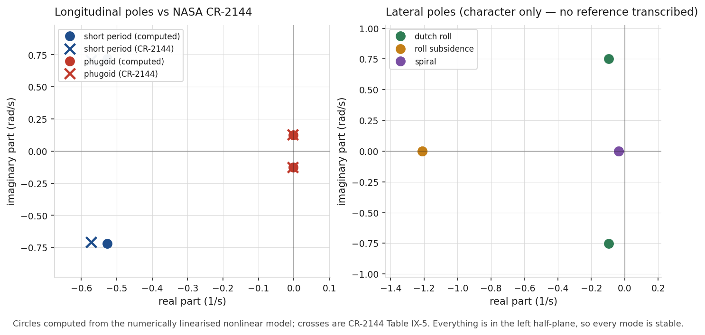
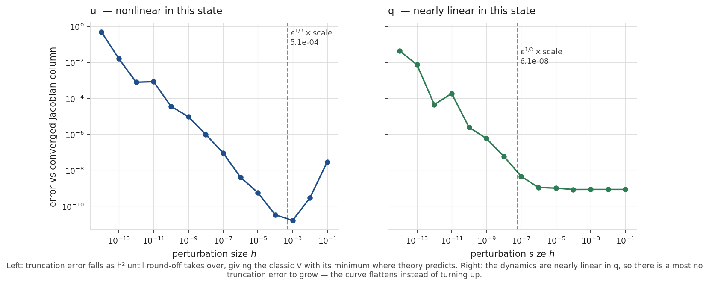
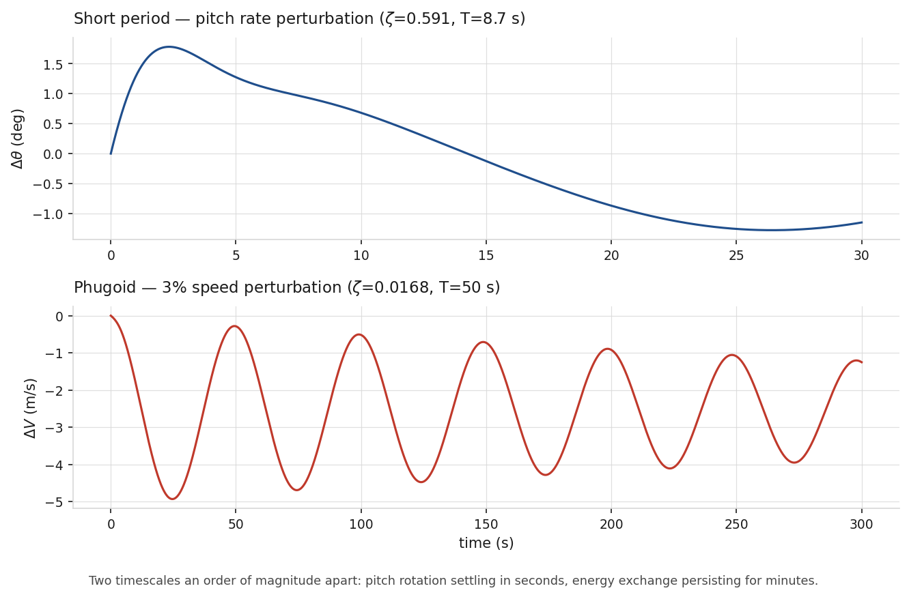

# Six-Degree-of-Freedom Flight Dynamics

A nonlinear rigid-body aircraft simulator built from the equations of motion, trimmed
by nonlinear root-finding, linearised numerically, and validated against forty-year-old
NASA flight data.

Aircraft and reference data: Boeing 747, NASA CR-2144 Section IX — Heffley &amp; Jewell,
*Aircraft Handling Qualities Data*, December 1972.

---

## Results

**Flight Condition 2** — power approach, sea level, 165 KTAS, 564,032 lb.

### Validation — do the modes match a real aircraft?

| Mode | | computed | CR-2144 | difference |
|---|---|---:|---:|---:|
| Short period | ζ | 0.5906 | 0.6290 | −6.1% |
| | ωₙ | 0.8923 | 0.9100 | **−1.9%** |
| Phugoid | ζ | 0.0168 | 0.0228 | −26.5% |
| | ωₙ | 0.1265 | 0.1270 | **−0.4%** |



**Frequencies agree to within 2%.** Damping is looser, and the phugoid worst — for a
reason that was predicted before the model was built. Phugoid damping is approximately
`CD/(√2·CL)`, set almost entirely by drag, and this model's `CD` carries no Mach term
because CR-2144 does not tabulate `CD_M` for this condition. The absolute error is
0.006 on a quantity of 0.023.

All five classical modes are recovered:

| Mode | Character |
|---|---|
| Short period | ζ = 0.591, T = 8.7 s |
| Phugoid | ζ = 0.017, T = 51 s |
| Dutch roll | ζ = 0.129, T = 8.3 s |
| Roll subsidence | τ = 0.82 s |
| Spiral | τ = 27 s, stable |

### Verification — did I implement the maths correctly?

The numerically linearised state matrix against CR-2144's *separately tabulated*
dimensional derivatives (Table IX-4, a different table from the validation data):

| Term | numerical | CR-2144 | diff | |
|---|---:|---:|---:|---|
| Xu | −0.010598 | −0.010800 | −1.9% | speed damping |
| Xw | 0.102943 | 0.106000 | −2.9% | |
| Zu | −0.150562 | −0.150000 | +0.4% | |
| Zw | −0.611309 | −0.613000 | −0.3% | heave damping |
| Mu | 0.000578 | 0.000594 | −2.7% | |
| Mw | −0.006325 | −0.006332 | −0.1% | pitch stiffness |
| Mq | −0.436376 | −0.437000 | −0.1% | pitch damping |

## The verification step earned its place

The first run produced this pattern:

```
Zw  0.1%    Mw  0.4%    Mq -0.1%    Xw -2.7%     ← w and q derivatives: excellent
Xu -20.4%   Zu +14.2%   Mu -59.6%                 ← every u derivative: bad
```

**The error was confined to one column.** All three bad terms were `∂/∂u` — how forces
change with speed — which pointed at exactly one cause: the coefficients had been built
without the **Mach derivatives**. Adding `CL_M` and `Cm_M` brought every term inside 3%.

The mode comparison had already looked acceptable and would have shrugged this off. That
is the entire argument for keeping verification and validation as separate evidence:

- Numerical Jacobian disagrees with Table IX-4 → **the implementation is wrong**, and
  the offending matrix element points straight at the equation.
- Matrices agree but eigenvalues miss Table IX-5 → implementation is fine, the **model**
  is the limitation. That is a result, not a mistake.

## Trim

```
alpha    = 5.520 deg      (CR-2144 Table IX-3 publishes 5.70 deg, independently)
elevator = 1.749 deg
throttle = 0.277
max residual = 1.14e-16
```

Trim is a nonlinear root-find: three unknowns driving `u̇ = ẇ = q̇ = 0`. Proven three
ways — residual at machine precision, propagated 60 s with controls fixed and nothing
moved, and a **negative control** confirming a state 10% fast *does* drift, so the hold
test has power.

## Choosing the perturbation size



Central differences carry truncation error ~h² and round-off ~ε/h, so the optimum sits
near `ε^(1/3) × scale`. For u that predicts 5.1×10⁻⁴; the measured minimum is 1×10⁻³.

**The right-hand panel is the more interesting one.** The dynamics are nearly *linear*
in pitch rate, so there is almost no truncation error to grow — the curve flattens
instead of turning up. Expecting a V there and "fixing" the code would be chasing a
phantom. The shape depends on the nonlinearity of the function, not the quality of the
implementation.

## Mode character



Two timescales an order of magnitude apart: pitch rotation settling in seconds, energy
exchange persisting for minutes.

## Quick start

```bash
pip install -e ".[dev]"
pytest                                    # 222 tests, ~47 s
python scripts/make_readme_figures.py
```

## Layout

```
src/flightdyn/
  units.py            the single boundary where CR-2144's imperial units enter
  frames.py           quaternions, DCMs, air data — no rotation library imported
  dynamics.py         6-DOF rigid-body equations, 13 states
  atmosphere.py       ISA to 20 km
  aerodynamics.py     linear-derivative aero + propulsion
  trim.py             nonlinear trim solver
  analysis/linear.py  numerical linearisation, eigenvalues, mode identification
  aircraft/b747.py    CR-2144 data with page references
tests/                222 tests
references/           CR-2144 (not vendored — cited)
```

## Conventions

| | |
|---|---|
| Units | SI and radians internally; a single tested conversion layer at the data boundary |
| Quaternion | scalar-first `[q0,q1,q2,q3]`, matching Stevens &amp; Lewis and Etkin &amp; Reid |
| DCM | `C_bn` maps NED → body |
| Euler | 3-2-1 (yaw, pitch, roll), used for **output and linearisation only, never integration** |

## Assumptions and limitations

- **The aerodynamics is linear**, in the perturbation variables. CR-2144 publishes
  derivatives, not tables. What is genuinely nonlinear is the rigid-body mechanics —
  the transport terms, quaternion kinematics, gravity rotating through attitude — and
  that is what trim and linearisation exercise. This is *not* a nonlinear aerodynamic
  model, and describing it as one would be overselling it.
- **Flat, non-rotating Earth.** At aircraft speeds over a mode analysis, Earth rotation
  and curvature are far below the aerodynamic uncertainty.
- **`CL0` is backed out** from the published trim values assuming the lift slope holds
  linearly to zero incidence, which for a flapped approach configuration it does not.
  Acceptable because everything of interest happens within a few degrees of trim.
- **Thrust is speed-independent** and has no spool-up dynamics.
- **Lateral modes are not validated against published values** — CR-2144's lateral
  transfer functions were not transcribed, so those tests check physical character only,
  and say so.
- **Derivatives were transcribed from a 1972 scan.** The text layer is unusable, so
  values were read from page images. Every one is cross-checked against physics rather
  than against itself (lift = weight to 0.20%, Mach reconciles to 0.00%, dynamic
  pressure to 0.38%), but `Cn_r` and `Cn_dr` had faint minus signs and are flagged in
  the source for visual confirmation.

## Development methodology

Developed with AI assistance (Claude Code) for implementation, tests, documentation and
diagnostics. Every engineering decision — conventions, axis systems, sign conventions,
the choice of flight condition, what to verify against what — was made and understood by
me, and the verification lives in the repository rather than being claimed about it:

- Rotations implemented from scratch and checked against `scipy` as an independent
  reference, with the scalar-order and active/passive mismatch made explicit.
- Physics tests check invariants, not stored outputs — conservation of energy and
  angular momentum, RK4 fourth-order convergence, and the intermediate-axis instability,
  which can only pass if `ω × Iω` is exactly right.
- External references throughout: ISA tables for the atmosphere, Kepler-scale checks on
  the units, and CR-2144 for both verification and validation.

[DEFENCE_PACK.md](DEFENCE_PACK.md) answers 21 questions covering every learning outcome,
including what was AI-assisted and how I know the result is right.

## License

MIT — see [LICENSE](LICENSE).
